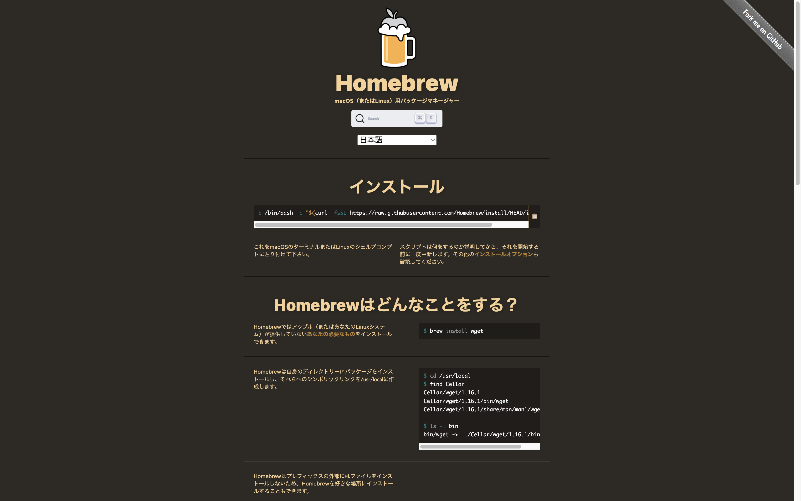

## Homebrewとは

Homebrew（ホームブルー、ホームブリュー）とはパッケージマネージャーと呼ばれ、Mac OSにインストールできるソフトウェアの管理を行うソフトウェアです。（Linux、Windows Subsystem for Linuxでも動作します）

Homebrewを利用することで、必要なパッケージをインストール、管理することが可能です。


<br>

## Homebrewのインストール方法

下記のコマンドをターミナル（Terminal）に貼り付け実行します。

```
/bin/bash -c "$(curl -fsSL https://raw.githubusercontent.com/Homebrew/install/HEAD/install.sh)"

```

ターミナル自体は、MacのSpotlight検索バーに「ターミナル」や「たーみなる」などと打ち込むことで立ち上げることができます。

上記のコマンドをターミナル（Terminal）に貼り付けEnterキーを押して実行してみてください。

途中、ターミナルに出力されるメッセージに従い進めてください。Enterキーを押す必要も環境によっては複数回ある場合があります。

### インストールされたかを確認する

インストールされたか確認するには、ターミナルに以下のコマンドを打ち込みます。

```
brew help
```

実行後、以下のような出力が出れば無事インストールされています。

```
Example usage:
  brew search TEXT|/REGEX/
  brew info [FORMULA|CASK...]
  brew install FORMULA|CASK...
  brew update
  brew upgrade [FORMULA|CASK...]
  brew uninstall FORMULA|CASK...
  brew list [FORMULA|CASK...]

Troubleshooting:
  brew config
  brew doctor
  brew install --verbose --debug FORMULA|CASK

Contributing:
  brew create URL [--no-fetch]
  brew edit [FORMULA|CASK...]

Further help:
  brew commands
  brew help [COMMAND]
  man brew
  https://docs.brew.sh
```


